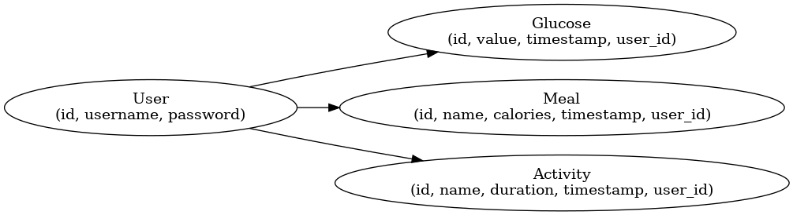

# DiaTrack AI - RESTful Routing Overview

DiaTrack AI is a RESTful API-driven backend built with Django and Django REST Framework to support diabetes management. The application provides authenticated users with endpoints to manage glucose levels, meals, activities, and authentication (signup/login).

---
Today we will take the following ERD diagram and generate the restful routing chart /table!

---
IN CLASS SOLUTION CODE:
---
## Glucose

| HTTP Verb | Path               | Action  | Description                        |
|-----------|--------------------|---------|------------------------------------|
| GET       | /api/glucose/      | index   | List all glucose entries           |
| POST      | /api/glucose/      | create  | Create a new glucose entry         |
| GET       | /api/glucose/:id/  | show    | Show details of a glucose entry    |
| PUT/PATCH | /api/glucose/:id/  | update  | Update a glucose entry             |
| DELETE    | /api/glucose/:id/  | destroy | Delete a glucose entry             |

---

## Meals

| HTTP Verb | Path              | Action  | Description                       |
|-----------|-------------------|---------|-----------------------------------|
| GET       | /api/meals/       | index   | List all meals                    |
| POST      | /api/meals/       | create  | Add a new meal                    |
| GET       | /api/meals/:id/   | show    | Show details of a meal            |
| PUT/PATCH | /api/meals/:id/   | update  | Update a meal entry               |
| DELETE    | /api/meals/:id/   | destroy | Delete a meal                     |

---

## Activities

| HTTP Verb | Path                  | Action  | Description                        |
|-----------|-----------------------|---------|------------------------------------|
| GET       | /api/activities/      | index   | List all activities                |
| POST      | /api/activities/      | create  | Add a new activity                 |
| GET       | /api/activities/:id/  | show    | Show details of an activity        |
| PUT/PATCH | /api/activities/:id/  | update  | Update an activity                 |
| DELETE    | /api/activities/:id/  | destroy | Delete an activity                 |

---

## Auth (JWT)

| HTTP Verb | Path                         | Action  | Description                                      |
|-----------|------------------------------|---------|--------------------------------------------------|
| POST      | /api/auth/signup/            | signup  | Register a new user                              |
| POST      | /api/auth/login/             | login   | Obtain access token (JWT)                        |
| POST      | /api/auth/token/refresh/     | refresh | Get new access token from refresh token          |

> All protected routes require the `Authorization: Bearer <token>` header.

---

## ERD (Entities):

- User
- Glucose
- Meal
- Activity

## IceBox Features

- Blood sugar prediction using ML integration
- Admin panel for monitoring users
- Email reminders for glucose checks
- Charts with filterable timelines (day, week, month)
- Export data to CSV/PDF
- Multi-language support